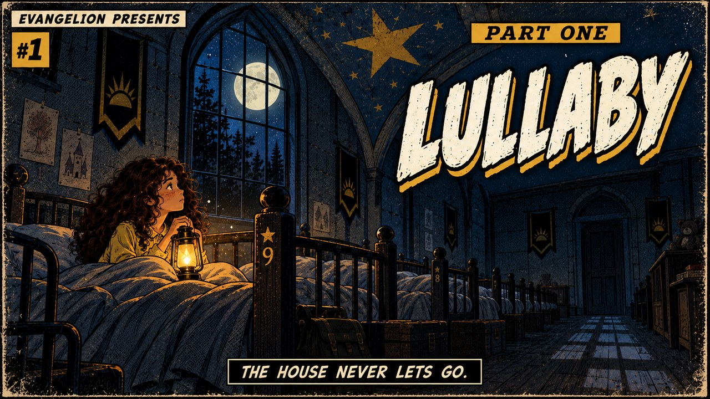
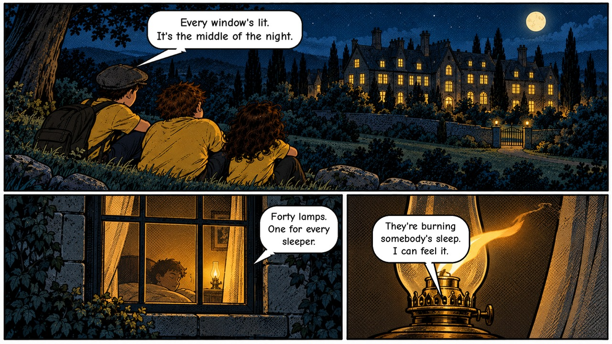
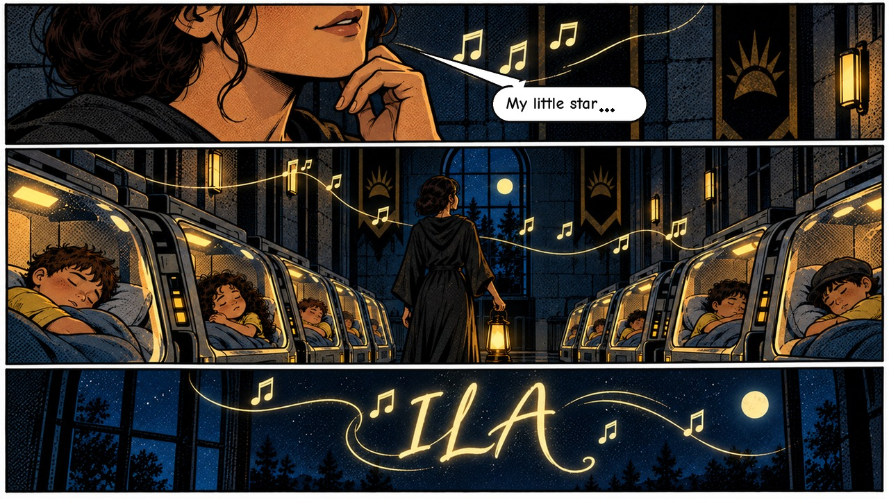
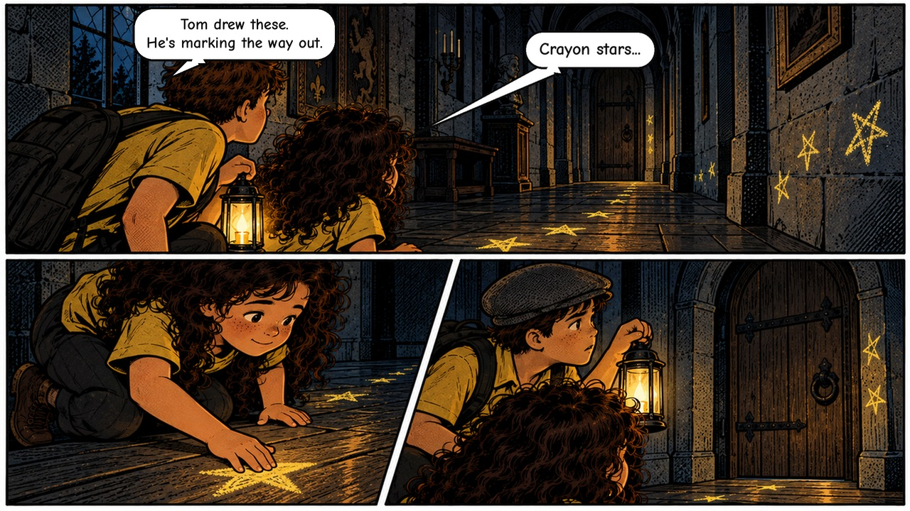

# The Stars That Sank Us To Sleep
### Part 1: Lullaby

   

*In the house on the hill, the children are loved, numbered, and never, ever let go.*

A stealth-platformer about a child who learns what the house is really for, and runs.

By Team Evangelion. Made for the Infinium'26 Game Jam (The Gaming Club, IIIT-H).

---

## Overview

The orphanage is warm. The beds are clean, the table is full, and every child is promised a family after their twelfth year. Nobody asks where the ones who left have gone.

One night the truth surfaces, and the only thing left to do is leave. Three kids, small and unarmed, slip past sleeping dorm-mates, through wardens' lanterns and out toward the forest. Nothing here can be fought. It can only be avoided, outlasted and, for as long as the song holds, outrun.

## Premise

On an alien world, children are raised in an orphanage that feels like home. A handful of wardens, led by Mom, watch over them. Part 1 follows Ness, Bram and Ila through the night of the escape.

## Features

- **Five chapters.** A single night, told in sequence from the dormitory to the forest edge.
- **Comic-page storytelling.** Story beats land as illustrated pages, not text dumps. Few cutscenes, each one chosen.
- **A lullaby you collect.** Every star you gather is a note of the song. Gather enough and the melody resolves.
- **Light-cone stealth.** Wardens and Mom patrol with lanterns. Their beams are the rules: stay out of the light, read the turn, move in the dark.
- **Escapable catches.** Being seen starts a one-second wind-up. Break line of sight in time and you slip away.
- **Music and sound.** Music and ambience from CC0 libraries, plus original synthesized cues, all credited in full.
- **Runs in the browser.** No install.

## From the pages

*The story is told in comic pages.*

## Age rating

PG-13. Dark themes, suspense and peril. Children in danger (depicted non-graphically). No gore, no explicit content.

## Controls

| Action | Input |
|---|---|
| Move | Left / Right arrows |
| Jump | Up / Space |
| Interact | E |
| Change kid | Q / 1 / 2 / 3 |
| Pause | P |

## Play

- itch.io: https://teamevangelion.itch.io/lullaby

## Technology

Built on the open-source Moth engine (MIT). Browser-native, TypeScript, bundled for the web.

## Credits

Third-party music, sound effects and ambience, with sources and licenses, are listed in [CREDITS.md](CREDITS.md).

By Team Evangelion - Panem Chaitanya Pavan Kumar, Metta Venkata Ramana Murthy, Prakash Bhabad.

## License

Released under the MIT License. See [LICENSE](LICENSE). Third-party assets remain under their own licenses, as listed in CREDITS.md.

---

*Team Evangelion*
